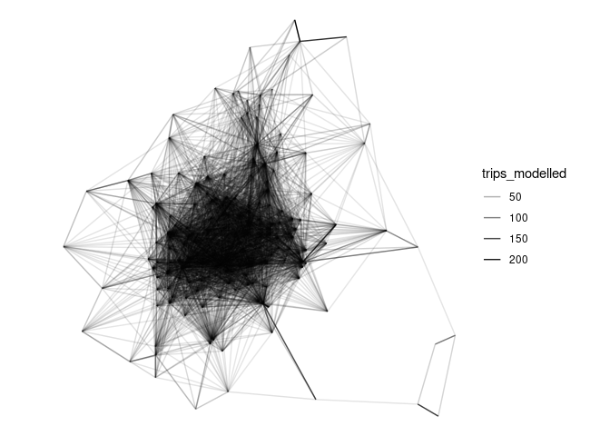
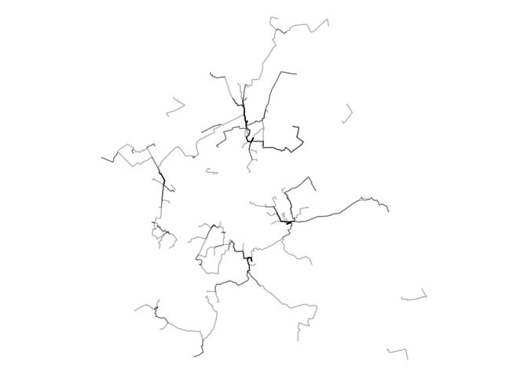

# Generate origin-destination data for route network generation


The input of the network generation approaches demonstrated in this repo
is origin-destionation data. There are many sources of OD data, see
[odgen](odgen.qmd) for a way to generate synthetic OD data that we’ll
use in the reproducible code below.

# Setup

For reproduducibility, we have setup a Docker container with all the
dependencies needed to run the code below. Pull the latest version of
the container with the following:

``` bash
docker pull ghcr.io/geocompx/docker:rust
```

Then open the project with the [.devcontainer.json](.devcontainer) file
in Visual Studio Code (see [VS Code
docs](https://code.visualstudio.com/docs/devcontainers/containers) for
more on this).

If you haven’t got project running in a container, you can run the code
below in your local environment.

<details>

To run the code below you need to have R and Docker installed. After you
have installed R, you can install the packages we’ll use as follows:

``` r
# Install pak if not already installed:
if (!requireNamespace("pak", quietly = TRUE)) {
  install.packages("pak")
}
pkgs = c("sf", "tidyverse", "tmap", "pak")
pkgs_to_install = pkgs[!pkgs %in% installed.packages()]
if (length(pkgs_to_install) > 0) {
  pak::pkg_install(pkgs_to_install)
}
# Load the packages with vapply:
vapply(pkgs, require, logical(1), character.only = TRUE)
```

We will also install a couple of package that are not on CRAN:

``` r
pak::pkg_install("acteng/netgen")
pak::pkg_install("Urban-Analytics-Technology-Platform/od2net/r")
```

<!-- ::: {.panel-tabset group="language"}
&#10;## R -->
</details>

After getting the software installed, load packages we’ll use as
follows:

``` r
library(sf)
library(tidyverse)
library(tmap)
# # Get the datasets, see: https://github.com/acteng/netgen/releases/tag/v0.1.0
# Automate data download if you have gh installed and authorised with:
# system("gh release download v0.1.0 --repo acteng/netgen")
# theme void:
theme_set(theme_void())
```

<!-- ## Python
&#10;```python
# import pandas as pd
# import geopandas as gpd
# 
# # Get the datasets we'll use with os and subprocess:
# import subprocess
# subprocess.run(["gh", "release", "download", "v0.1.0"])
```
&#10;:::
&#10;
&#10;::: {.panel-tabset group="language"}
&#10;## R
&#10;## Python
&#10;```python
# od = pd.read_csv("res_output.csv")
# od.head()
# # TBC
```
&#10;:::
&#10;-->

# Data import and visualisation

It’s worth importing and visualising the OD datasets before routing and
network generation stages.

``` r
od = read_csv("res_output.csv")
head(od)
```

    # A tibble: 6 × 3
      O              D trips_modelled
      <chr>      <dbl>          <dbl>
    1 E01013335 121266          6.37 
    2 E01013336 121266          3.26 
    3 E01013337 121266          4.57 
    4 E01013338 121266          6.46 
    5 E01013339 121266          2.95 
    6 E01013340 121266          0.124

``` r
od_geo = sf::read_sf("res_output.geojson")
od_geo |>
  ggplot() +
  geom_sf(aes(alpha = trips_modelled))
```



# od2net

Building on code in the
[od2net](https://urban-analytics-technology-platform.github.io/od2net/r/)
R package, we can generate the files needed for the network generation
stage.

After you have installed the package, prepare the input datasets and run
the network-generation code to generate output.geojson and
output.pmtiles outputs:

``` r
origin_zones = netgen::zones_york
names(origin_zones)
names(origin_zones)[1] = "name"
sf::write_sf(origin_zones, "input/zones_york.geojson", delete_dsn = TRUE)
od2net::make_osm(zones_file = "input/zones_york.geojson")
od2net::make_origins()
# Optionally, get elevation data:
# netgen:::make_elevation()
destinations = netgen::destinations_york # Provided in the R package
names(destinations)[1] = "name"
destinations = destinations[1]
class(destinations$name) = "character"
sf::write_sf(destinations, "input/destinations.geojson", delete_dsn = TRUE)
# Save the OD dataset:
od = od_geo |>
  sf::st_drop_geometry() |>
  transmute(from = O, to = as.character(D), count = round(trips_modelled))
readr::write_csv(od, "input/od.csv", quote = "all")
```

If you are running the code in a container, you should already have the
`od2net` package installed. Check this with the following:

``` r
system("od2net --version")
```

<!-- If you don't have it, you can copy the path /root/.cargo/bin/od2net to /usr/local/bin/ as follows: -->

Then run the following code to generate the network:

``` r
system("od2net config.json --rng-seed 42")
```

See below how to run it with Docker if you’re not running these commands
in the .devcontainer and you don’t have od2net installed.

<details>

Run the tool with Docker as follows:

``` bash
# On Linux:
sudo docker run -v $(pwd):/app ghcr.io/urban-analytics-technology-platform/od2net:main /app/config.json  --rng-seed 42
# On Windows:
docker run -v %cd%:/app ghcr.io/urban-analytics-technology-platform/od2net:main /app/config.json  --rng-seed 42
```

</details>

After that you should see the following in the output folder:

``` r
fs::dir_tree("output")
```

    output
    ├── counts.csv
    ├── failed_requests.geojson
    ├── output.geojson
    ├── rnet.pmtiles
    └── rnet_output_osrm_overline.geojson

From that point you can visualise the pmtiles in the website at
[od2net.org](https://od2net.org) or other front-end application, as
shown below.

## Minimal od2net example

For the purposes of testing it’s worth

## Adjusting uptake functions

The example above visualises *all* trips to school, not just active
travel trips.

## Other approaches to network generation

An advantage of `od2net` is that it can generate the network and routes
in a single step. For other approaches, we need to calculate the routes
first, as shown below.

<details>

# Routing

There are many ways to calculate routes. The simplest in many cases will
be to calculate them with a routing engine. Let’s do that with
interfaces to the OSRM routing engine in the first instance. Note: if
you use the `od2net` approach, you can do the routing and network
generation stage in a single step, see below for more on that.

## OSRM: basic

``` r
od_geo_top_100 = od_geo |>
  slice_max(trips_modelled, n = 100) 
```

``` r
routes_osrm_minimal = stplanr::route(
  l = od_geo_top_100,
  route_fun = stplanr::route_osrm,
  osrm.profile = "foot"
)
```

``` r
routes_osrm_minimal |>
  ggplot() +
  geom_sf(alpha = 0.3, size = 9)
```



## Locally hosted OSRM

We can spin-up a local OSRM server to calculate routes as
[follows](https://github.com/Project-OSRM/osrm-backend#using-docker):

``` r
location = osmextract::oe_match(
  od_geo_top_100 |> sf::st_union()
)
osmextract::oe_download(
    location$url,
    file_basename = "osm.pbf",
    download_directory = "."
)
```

Then with the system shell:

``` bash
docker run -t -v "${PWD}:/data" ghcr.io/project-osrm/osrm-backend osrm-extract -p /opt/car.lua /data/geofabrik_osm.pbf || echo "osrm-extract failed"
docker run -t -v "${PWD}:/data" ghcr.io/project-osrm/osrm-backend osrm-extract -p /opt/car.lua /data/geofrabik_osm.osm.pbf || echo "osrm-extract failed"
```

That should generate something like:

    [2024-08-27T15:00:31.786775132] [info] Expansion: 766813 nodes/sec and 382310 edges/sec
    [2024-08-27T15:00:31.786776903] [info] To prepare the data for routing, run: ./osrm-contract "/data/geofabrik_osm"
    [2024-08-27T15:00:31.836550204] [info] RAM: peak bytes used: 532934656

Note the process used 532934656 bytes (532.9 MB) of RAM.

Then:

``` bash
docker run -t -v "${PWD}:/data" ghcr.io/project-osrm/osrm-backend osrm-partition /data/geofabrik_osm.osrm || echo "osrm-partition failed"
docker run -t -v "${PWD}:/data" ghcr.io/project-osrm/osrm-backend osrm-customize /data/geofabrik_osm.osrm || echo "osrm-customize failed"
docker run -t -i -p 5000:5000 -v "${PWD}:/data" ghcr.io/project-osrm/osrm-backend osrm-routed --algorithm mld /data/geofabrik_osm
```

Check it is alive as follows:

``` r
system('curl "http://127.0.0.1:5000/route/v1/driving/13.388860,52.517037;13.385983,52.496891?steps=true"')
```

Now we can run all the routes:

``` r
routes_osrm_2 = stplanr::route(
  l = od_geo,
  route_fun = stplanr::route_osrm,
  osrm.profile = "foot",
  osrm.server = "http://127.0.0.1:5000/"
)
```

``` r
sf::write_sf(routes_osrm_2, "routes_osrm_2.geojson", delete_dsn = TRUE) 
system("gh release upload v0.1.0 routes_osrm_2.geojson")
```

Let’s visualise the routes:

``` r
routes_osrm_2 |>
  ggplot() +
  geom_sf(alpha = 0.3, size = 9)
```


# Network generation

## Overline

The `overline()` function in the R package stplanr is one way to to
generate route networks:

``` r
names(routes_osrm_2)
rnet = stplanr::overline(routes_osrm_2, attrib = "trips_modelled")
plot(rnet)
```

A disadvantage of this approach is that it’s computational
resource-intensive and takes a long time. An in-progress is `od2net`.

</details>

# Comparing od2net and overline outputs
