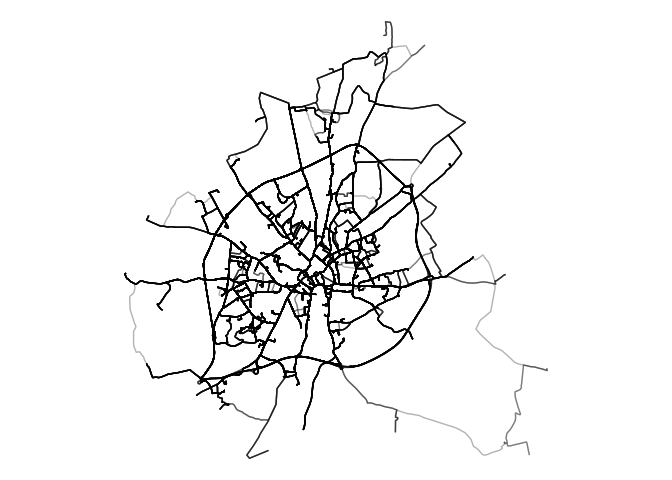

# Generate origin-destination data for route network generation


The input of the network generation approaches demonstrated in this repo
is origin-destionation data. There are many sources of OD data, see
[odgen](odgen.qmd) for a way to generate synthetic OD data that we’ll
use in the reproducible code below.

# Setup

<div class="panel-tabset" group="language">

## R

<!---
 jn: I would suggest to use specific packages from tidyverse instead of attaching the whole tidyverse 
&#10;rl: Why? Tidyverse is popular and it makes life easy.
Also that's the approach in the teaching materials.
For the book and for software development that's another matter but for this blog post I think it's fine.
--->

``` r
library(sf)
library(tidyverse)
library(tmap)
# Get the datasets we'll use
system("gh release download v0.1.0")
# theme void:
theme_set(theme_void())
```

## Python

``` python
import pandas as pd
import geopandas as gpd

# Get the datasets we'll use with os and subprocess:
import subprocess
subprocess.run(["gh", "release", "download", "v0.1.0"])
```

    CompletedProcess(args=['gh', 'release', 'download', 'v0.1.0'], returncode=1)

</div>

# Data import and visualisation

It’s worth importing and visualising the OD datasets before routing and
network generation stages.

<div class="panel-tabset" group="language">

## R

``` r
od = read_csv("res_output.csv")
head(od)
```

    # A tibble: 6 × 3
      O              D trips_modelled
      <chr>      <dbl>          <dbl>
    1 E01013335 121266          6.37 
    2 E01013336 121266          3.26 
    3 E01013337 121266          4.57 
    4 E01013338 121266          6.46 
    5 E01013339 121266          2.95 
    6 E01013340 121266          0.124

``` r
od_geo = sf::read_sf("res_output.geojson")
od_geo |>
  ggplot() +
  geom_sf(aes(alpha = trips_modelled))
```


## Python

``` python
od = pd.read_csv("res_output.csv")
od.head()
```

               O       D  trips_modelled
    0  E01013335  121266        6.372102
    1  E01013336  121266        3.264443
    2  E01013337  121266        4.566013
    3  E01013338  121266        6.463300
    4  E01013339  121266        2.953231

``` python
# TBC
```

</div>

# Routing

There are many ways to calculate routes. The simplest in many cases will
be to calculate them with a routing engine. Let’s do that with
interfaces to the OSRM routing engine in the first instance.

## OSRM: basic

``` r
od_geo_top_100 = od_geo |>
  slice_max(trips_modelled, n = 100) 
```

``` r
routes_osrm_minimal = stplanr::route(
  l = od_geo_top_100,
  route_fun = stplanr::route_osrm,
  osrm.profile = "foot"
)
```

``` r
routes_osrm_minimal = sf::read_sf("routes_osrm_minimal.geojson")
```

``` r
routes_osrm_minimal |>
  ggplot() +
  geom_sf(alpha = 0.3, size = 9)
```


## Locally hosted OSRM

We can spin-up a local OSRM server to calculate routes as
[follows](https://github.com/Project-OSRM/osrm-backend#using-docker):

``` r
location = osmextract::oe_match(
  od_geo_top_100 |> sf::st_union()
)
osmextract::oe_download(
    location$url,
    file_basename = "osm.pbf",
    download_directory = "."
)
```

    [1] "/home/robinlovelace-ate/github/acteng/netgen/geofabrik_osm.pbf"

Then with the system shell:

``` bash
docker run -t -v "${PWD}:/data" ghcr.io/project-osrm/osrm-backend osrm-extract -p /opt/car.lua /data/geofabrik_osm.pbf || echo "osrm-extract failed"
docker run -t -v "${PWD}:/data" ghcr.io/project-osrm/osrm-backend osrm-extract -p /opt/car.lua /data/geofrabik_osm.osm.pbf || echo "osrm-extract failed"
```

That should generate something like:

    [2024-08-27T15:00:31.786775132] [info] Expansion: 766813 nodes/sec and 382310 edges/sec
    [2024-08-27T15:00:31.786776903] [info] To prepare the data for routing, run: ./osrm-contract "/data/geofabrik_osm"
    [2024-08-27T15:00:31.836550204] [info] RAM: peak bytes used: 532934656

Note the process used 532934656 bytes (532.9 MB) of RAM.

Then:

``` bash
docker run -t -v "${PWD}:/data" ghcr.io/project-osrm/osrm-backend osrm-partition /data/geofabrik_osm.osrm || echo "osrm-partition failed"
docker run -t -v "${PWD}:/data" ghcr.io/project-osrm/osrm-backend osrm-customize /data/geofabrik_osm.osrm || echo "osrm-customize failed"
docker run -t -i -p 5000:5000 -v "${PWD}:/data" ghcr.io/project-osrm/osrm-backend osrm-routed --algorithm mld /data/geofabrik_osm
```

Check it is alive as follows:

``` r
system('curl "http://127.0.0.1:5000/route/v1/driving/13.388860,52.517037;13.385983,52.496891?steps=true"')
```

Now we can run all the routes:

``` r
routes_osrm_2 = stplanr::route(
  l = od_geo,
  route_fun = stplanr::route_osrm,
  osrm.profile = "foot",
  osrm.server = "http://127.0.0.1:5000/"
)
```

``` r
sf::write_sf(routes_osrm_2, "routes_osrm_2.geojson", delete_dsn = TRUE) 
system("gh release upload v0.1.0 routes_osrm_2.geojson")
```

Let’s visualise the routes:

``` r
routes_osrm_2 |>
  ggplot() +
  geom_sf(alpha = 0.3, size = 9)
```



# Network generation
