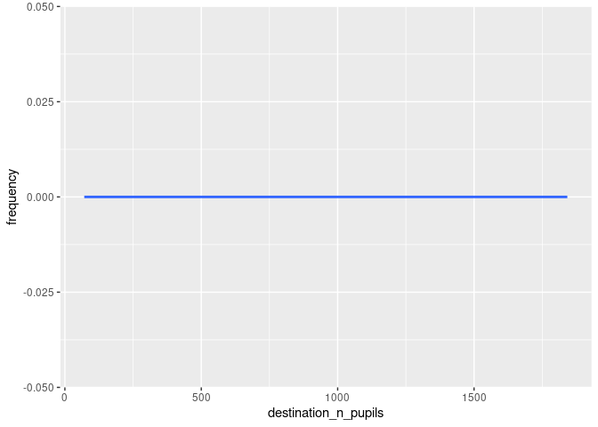
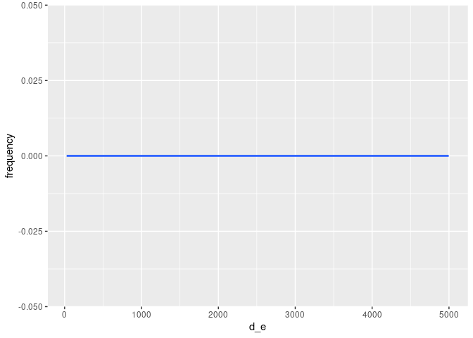
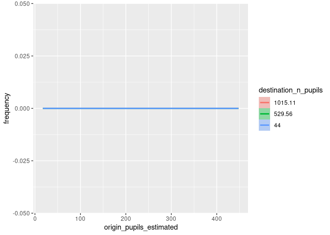
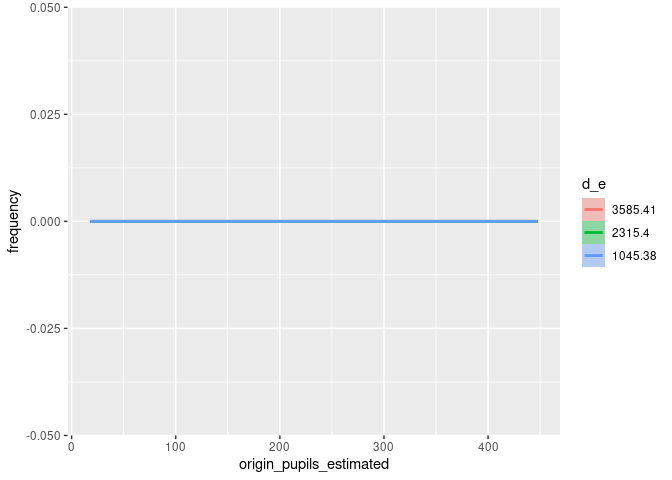
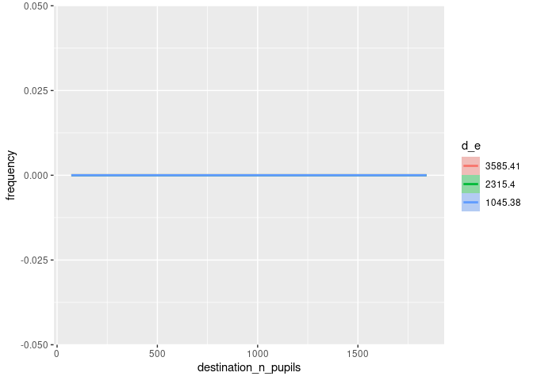

# Generate origin-destination data and route networks


# Introduction

The code in this results demonstrates how to generate origin-destination
(OD) data for a given set of zones and destinations. OD data is a key
input into spatial interaction models (SIMs) for generating route
networks. (See [An introduction to spatial interaction models: from
first
principles](https://robinlovelace.github.io/simodels/articles/sims-first-principles.html)
introduction to SIMs for more information.) The code is fully
reproducible, although requires a validation dataset that is not in the
public domain to generate goodness-of-fit statistics shown in this
README.

Install the package as follows (you can also clone the repo and run
`devtools::load_all()`):

``` r
if (!require("devtools")) install.packages("devtools")
devtools::install_github("acteng/netgen")
```

The package uses the [`{simodels}` R
package](https://robinlovelace.github.io/simodels/) to pre-process the
input datasets and generate the OD data used as the basis of the
interaction prediction model. The input datasets are illustrated in the
figure below (these are `zones_york` and `destinations_york` that are
provided with the pacage):


Before we run any models let’s compare the total number of pupils in the
zones dataset and the destinations dataset (they should be the same):

``` r
zone_overestimate_factor = 
  (sum(zones_york$f0_to_15) + sum(zones_york$m0_to_15)) /
    sum(destinations_york$n_pupils)
zone_overestimate_factor
```

    [1] 1.194998

As one would expect, the total number of pupils in the zones dataset is
a bit bigger than the total number of pupils in the destinations
dataset: not all people aged 0 to 15 go to school, especially those
under school age. To tackle this issue we’ll create a new variables
called `pupils_estimated` in the zones dataset, which is the sum of the
number of pupils in the zones dataset and the number of pupils in the
destinations dataset.

``` r
zones_york = zones_york |>
  dplyr::mutate(
    pupils_estimated = (f0_to_15 + m0_to_15) / zone_overestimate_factor
  )
```

After the adjustment shown above, the totals in the origin and
destination columns should be the same:

``` r
sum(zones_york$pupils_estimated)
```

    [1] 25631

``` r
sum(destinations_york$n_pupils)
```

    [1] 25631

# Preprocessing

Based on these inputs the `si_to_od()` function generates the OD data,
as shown below (note: 2 versions are created, one with a maximum
distance constraint for speed of processing, important when working with
large datasets).

``` r
max_dist = 5000 # meters
od_from_si_full = simodels::si_to_od(zones_york, destinations_york)
od_from_si = simodels::si_to_od(zones_york, destinations_york, max_dist = max_dist)
```


The output OD dataset has column names taken from both the origin and
destination datasets, with the following column names:

     [1] "O"                                 "D"                                
     [3] "distance_euclidean"                "origin_LSOA21NM"                  
     [5] "origin_total"                      "origin_f0_to_15"                  
     [7] "origin_f16_to_29"                  "origin_f30_to_44"                 
     [9] "origin_f45_to_64"                  "origin_f65_and_over"              
    [11] "origin_m0_to_15"                   "origin_m16_to_29"                 
    [13] "origin_m30_to_44"                  "origin_m45_to_64"                 
    [15] "origin_m65_and_over"               "origin_pupils_estimated"          
    [17] "destination_n_pupils"              "destination_phase"                
    [19] "destination_type_of_establishment" "geometry"                         

# A basic model

## An unconstrained model

Let’s run a simple model:

``` r
gravity_model = function(beta, d, m, n) {
  m * n * exp(-beta * d / 1000)
} 
# perform SIM
od_res = simodels::si_calculate(
  od_from_si,
  fun = gravity_model,
  d = distance_euclidean,
  m = origin_pupils_estimated,
  n = destination_n_pupils,
#   constraint_production = origin_all,
  beta = 0.9
  )
```

We’ll make one adjustment to the output dataset, renaming the
`interaction` column to `trips`, and setting the total number of trips
to be the same as the total number of pupils in the destinations
dataset:

``` r
interaction_overestimate_factor = sum(destinations_york$n_pupils) / sum(od_res$interaction)
od_res = od_res |>
  dplyr::mutate(
    trips = interaction * interaction_overestimate_factor
  )
```

We can assess the model fit at three levels: the origin level (number of
students departing from each zone), the destination level (the number
arriving at each school in the input dataset) and the origin-destination
level.


The R-squared value is 0.401.

## Production-constrained model

Let’s see if making the model production constrained can help:

``` r
res_constrained = simodels::si_calculate(
  od_from_si,
  fun = gravity_model,
  d = distance_euclidean,
  m = origin_pupils_estimated,
  n = destination_n_pupils,
  constraint_production = origin_pupils_estimated,
  beta = 0.9
  )
```


The R-squared value is 0.57.

## Doubly-constrained model

Let’s implement a doubly-constrained model, starting with the outputs of
the production-constrained model:

``` r
res_doubly_constrained = res_constrained |>
  group_by(D) |>
  mutate(
    observed_group = first(destination_n_pupils),
    modelled_group = sum(interaction),
    modelled_overestimate_factor = modelled_group / observed_group,
    interaction = interaction / modelled_overestimate_factor
  )
# summary(res_doubly_constrained)
sum(res_doubly_constrained$interaction) == sum(res_constrained$interaction) 
```

    [1] TRUE


The R-squared value is 0.579.

The model is now ‘doubly constrained’ in a basic sense: the first
iteration constrains the totals for each origin to the observed totals,
and the second iteration constrains the totals for each destination to
the observed totals.

Let’s constrain by the origin totals again:

``` r
res_doubly_constrained_2 = res_doubly_constrained |>
  group_by(O) |>
  mutate(
    observed_group = first(origin_pupils_estimated),
    modelled_group = sum(interaction),
    modelled_overestimate_factor = modelled_group / observed_group,
    interaction = interaction / modelled_overestimate_factor
  )
```

And then by the destination totals again:

``` r
res_doubly_constrained_3 = res_doubly_constrained_2 |>
  group_by(D) |>
  mutate(
    observed_group = first(destination_n_pupils),
    modelled_group = sum(interaction),
    modelled_overestimate_factor = modelled_group / observed_group,
    interaction = interaction / modelled_overestimate_factor
  )
```

After one more full iteration of fitting to the observed totals, the
R-squared value is 0.592.

Additional iterations do not increase model fit against the observed OD
data in this case (working not shown).

# Fitting model parameters

So far, arbitrary values have been used for the beta parameter in the
gravity model. Let’s try to do better by fitting a model.

<!-- We'll first create a new distance variable that is 1 if the the distance is less than 1 km. -->

We’ll also calculate the log of the distance.


We now fit models with `lm()`:

``` r
m1 = od_from_si |>
  lm(frequency ~ log_distance, data = _)
# With origin_pupils_estimated:
m2 = od_from_si |>
  lm(frequency ~ log_distance + origin_pupils_estimated, data = _)
# With destination_n_pupils:
m3 = od_from_si |>
  lm(frequency ~ log_distance + destination_n_pupils, data = _)
# With both:
m4 = od_from_si |>
  lm(frequency ~ log_distance + origin_pupils_estimated + destination_n_pupils, data = _)
# With m x n:
m5 = od_from_si |>
  lm(frequency ~ log_distance + I(origin_pupils_estimated * destination_n_pupils), data = _)
```

The models are not particularly good at predicting the observed data, as
shown by the R-squared values, which range from 0.218 to 0.333.

# Non-linear models

We can estimate the `beta` parameter in the gravity model using
non-linear least squares regression in the following function (from
above)

     [1] "O"                                 "D"                                
     [3] "distance_euclidean"                "origin_LSOA21NM"                  
     [5] "origin_total"                      "origin_f0_to_15"                  
     [7] "origin_f16_to_29"                  "origin_f30_to_44"                 
     [9] "origin_f45_to_64"                  "origin_f65_and_over"              
    [11] "origin_m0_to_15"                   "origin_m16_to_29"                 
    [13] "origin_m30_to_44"                  "origin_m45_to_64"                 
    [15] "origin_m65_and_over"               "origin_pupils_estimated"          
    [17] "destination_n_pupils"              "destination_phase"                
    [19] "destination_type_of_establishment" "frequency"                        
    [21] "geometry"                          "distance_km"                      
    [23] "log_distance"                     

Let’s try to do this with a {brms} formula as follows:

``` r
library(brms)
# Define formula:
f = bf(frequency ~ origin_pupils_estimated * destination_n_pupils * 
  exp(-beta * distance_euclidean / 1000), beta ~ 1, nl = TRUE)
# Fit model:
m_b1 = brm(
  f,
  data = od_from_si
)
```


    SAMPLING FOR MODEL 'anon_model' NOW (CHAIN 1).
    Chain 1: 
    Chain 1: Gradient evaluation took 0.000196 seconds
    Chain 1: 1000 transitions using 10 leapfrog steps per transition would take 1.96 seconds.
    Chain 1: Adjust your expectations accordingly!
    Chain 1: 
    Chain 1: 
    Chain 1: Iteration:    1 / 2000 [  0%]  (Warmup)
    Chain 1: Iteration:  200 / 2000 [ 10%]  (Warmup)
    Chain 1: Iteration:  400 / 2000 [ 20%]  (Warmup)
    Chain 1: Iteration:  600 / 2000 [ 30%]  (Warmup)
    Chain 1: Iteration:  800 / 2000 [ 40%]  (Warmup)
    Chain 1: Iteration: 1000 / 2000 [ 50%]  (Warmup)
    Chain 1: Iteration: 1001 / 2000 [ 50%]  (Sampling)
    Chain 1: Iteration: 1200 / 2000 [ 60%]  (Sampling)
    Chain 1: Iteration: 1400 / 2000 [ 70%]  (Sampling)
    Chain 1: Iteration: 1600 / 2000 [ 80%]  (Sampling)
    Chain 1: Iteration: 1800 / 2000 [ 90%]  (Sampling)
    Chain 1: Iteration: 2000 / 2000 [100%]  (Sampling)
    Chain 1: 
    Chain 1:  Elapsed Time: 0.762 seconds (Warm-up)
    Chain 1:                0.778 seconds (Sampling)
    Chain 1:                1.54 seconds (Total)
    Chain 1: 

    SAMPLING FOR MODEL 'anon_model' NOW (CHAIN 2).
    Chain 2: 
    Chain 2: Gradient evaluation took 0.000125 seconds
    Chain 2: 1000 transitions using 10 leapfrog steps per transition would take 1.25 seconds.
    Chain 2: Adjust your expectations accordingly!
    Chain 2: 
    Chain 2: 
    Chain 2: Iteration:    1 / 2000 [  0%]  (Warmup)
    Chain 2: Iteration:  200 / 2000 [ 10%]  (Warmup)
    Chain 2: Iteration:  400 / 2000 [ 20%]  (Warmup)
    Chain 2: Iteration:  600 / 2000 [ 30%]  (Warmup)
    Chain 2: Iteration:  800 / 2000 [ 40%]  (Warmup)
    Chain 2: Iteration: 1000 / 2000 [ 50%]  (Warmup)
    Chain 2: Iteration: 1001 / 2000 [ 50%]  (Sampling)
    Chain 2: Iteration: 1200 / 2000 [ 60%]  (Sampling)
    Chain 2: Iteration: 1400 / 2000 [ 70%]  (Sampling)
    Chain 2: Iteration: 1600 / 2000 [ 80%]  (Sampling)
    Chain 2: Iteration: 1800 / 2000 [ 90%]  (Sampling)
    Chain 2: Iteration: 2000 / 2000 [100%]  (Sampling)
    Chain 2: 
    Chain 2:  Elapsed Time: 0.953 seconds (Warm-up)
    Chain 2:                64.352 seconds (Sampling)
    Chain 2:                65.305 seconds (Total)
    Chain 2: 

    SAMPLING FOR MODEL 'anon_model' NOW (CHAIN 3).
    Chain 3: 
    Chain 3: Gradient evaluation took 0.000125 seconds
    Chain 3: 1000 transitions using 10 leapfrog steps per transition would take 1.25 seconds.
    Chain 3: Adjust your expectations accordingly!
    Chain 3: 
    Chain 3: 
    Chain 3: Iteration:    1 / 2000 [  0%]  (Warmup)
    Chain 3: Iteration:  200 / 2000 [ 10%]  (Warmup)
    Chain 3: Iteration:  400 / 2000 [ 20%]  (Warmup)
    Chain 3: Iteration:  600 / 2000 [ 30%]  (Warmup)
    Chain 3: Iteration:  800 / 2000 [ 40%]  (Warmup)
    Chain 3: Iteration: 1000 / 2000 [ 50%]  (Warmup)
    Chain 3: Iteration: 1001 / 2000 [ 50%]  (Sampling)
    Chain 3: Iteration: 1200 / 2000 [ 60%]  (Sampling)
    Chain 3: Iteration: 1400 / 2000 [ 70%]  (Sampling)
    Chain 3: Iteration: 1600 / 2000 [ 80%]  (Sampling)
    Chain 3: Iteration: 1800 / 2000 [ 90%]  (Sampling)
    Chain 3: Iteration: 2000 / 2000 [100%]  (Sampling)
    Chain 3: 
    Chain 3:  Elapsed Time: 1.026 seconds (Warm-up)
    Chain 3:                0.688 seconds (Sampling)
    Chain 3:                1.714 seconds (Total)
    Chain 3: 

    SAMPLING FOR MODEL 'anon_model' NOW (CHAIN 4).
    Chain 4: 
    Chain 4: Gradient evaluation took 0.000121 seconds
    Chain 4: 1000 transitions using 10 leapfrog steps per transition would take 1.21 seconds.
    Chain 4: Adjust your expectations accordingly!
    Chain 4: 
    Chain 4: 
    Chain 4: Iteration:    1 / 2000 [  0%]  (Warmup)
    Chain 4: Iteration:  200 / 2000 [ 10%]  (Warmup)
    Chain 4: Iteration:  400 / 2000 [ 20%]  (Warmup)
    Chain 4: Iteration:  600 / 2000 [ 30%]  (Warmup)
    Chain 4: Iteration:  800 / 2000 [ 40%]  (Warmup)
    Chain 4: Iteration: 1000 / 2000 [ 50%]  (Warmup)
    Chain 4: Iteration: 1001 / 2000 [ 50%]  (Sampling)
    Chain 4: Iteration: 1200 / 2000 [ 60%]  (Sampling)
    Chain 4: Iteration: 1400 / 2000 [ 70%]  (Sampling)
    Chain 4: Iteration: 1600 / 2000 [ 80%]  (Sampling)
    Chain 4: Iteration: 1800 / 2000 [ 90%]  (Sampling)
    Chain 4: Iteration: 2000 / 2000 [100%]  (Sampling)
    Chain 4: 
    Chain 4:  Elapsed Time: 2.5 seconds (Warm-up)
    Chain 4:                0.575 seconds (Sampling)
    Chain 4:                3.075 seconds (Total)
    Chain 4: 

Let’s plot the results:












# Nearest neighbour model

# Multi-level models

SIMs can be seen as a multi-level system, with origins and destinations
at different levels. We will try fitting a multi-level model to the
data.
