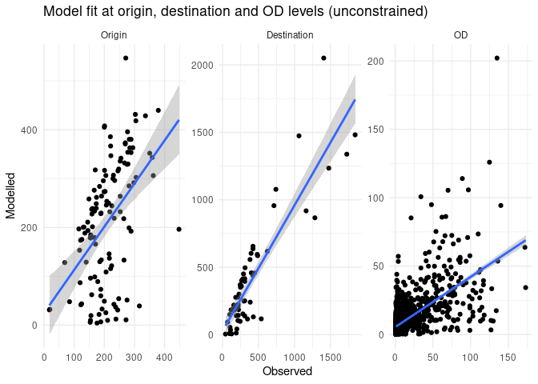

# Generate origin-destination data and route networks


The code in this results demonstrates how to generate origin-destination
(OD) data for a given set of zones and destinations. OD data is a key
input into spatial interaction models (SIMs) for generating route
networks. (See [An introduction to spatial interaction models: from
first
principles](https://robinlovelace.github.io/simodels/articles/sims-first-principles.html)
introduction to SIMs for more information.) The code is fully
reproducible, although requires a validation dataset that is not in the
public domain to generate goodness-of-fit statistics shown in this
README.

Install the package as follows (you can also clone the repo and run
`devtools::load_all()`):

``` r
if (!require("devtools")) install.packages("devtools")
devtools::install_github("acteng/netgen")
```

The package uses the [`{simodels}` R
package](https://robinlovelace.github.io/simodels/) to pre-process the
input datasets and generate the OD data used as the basis of the
interaction prediction model. The input datasets are illustrated in the
figure below:


Based on these inputs the `si_to_od()` function generates the OD data,
as shown below (note: 2 versions are created, one with a maximum
distance constraint for speed of processing, important when working with
large datasets):

``` r
max_dist = 5000 # meters
od_from_si_full = simodels::si_to_od(zones_york, destinations_york)
od_from_si = simodels::si_to_od(zones_york, destinations_york, max_dist = max_dist)
```

    4338 OD pairs remaining after removing those with a distance greater than 5000 meters:
    57% of all possible OD pairs


The output OD dataset has column names taken from both the origin and
destination datasets, with the following column names:

     [1] "O"                                 "D"                                
     [3] "distance_euclidean"                "origin_LSOA21NM"                  
     [5] "origin_total"                      "origin_f0_to_15"                  
     [7] "origin_f16_to_29"                  "origin_f30_to_44"                 
     [9] "origin_f45_to_64"                  "origin_f65_and_over"              
    [11] "origin_m0_to_15"                   "origin_m16_to_29"                 
    [13] "origin_m30_to_44"                  "origin_m45_to_64"                 
    [15] "origin_m65_and_over"               "destination_n_pupils"             
    [17] "destination_phase"                 "destination_type_of_establishment"
    [19] "geometry"                         

Let’s run a simple model:

``` r
gravity_model = function(beta, d, m, n) {
  m * n * exp(-beta * d / 1000)
} 
# perform SIM
od_res = simodels::si_calculate(
  od_from_si,
  fun = gravity_model,
  d = distance_euclidean,
  m = origin_f0_to_15,
  n = destination_n_pupils,
#   constraint_production = origin_all,
  beta = 0.9
  )
```

We can assess the model fit, starting with a scatter plot and a simple
R-squared test:

    `geom_smooth()` using formula = 'y ~ x'



The R-squared value is 0.4.

Let’s see if making the model production constrained can help:

``` r
od_res_constrained = simodels::si_calculate(
  od_from_si,
  fun = gravity_model,
  d = distance_euclidean,
  m = origin_f0_to_15,
  n = destination_n_pupils,
  constraint_production = origin_f0_to_15,
  beta = 0.9
  )
```

The R-squared value is 0.562.
