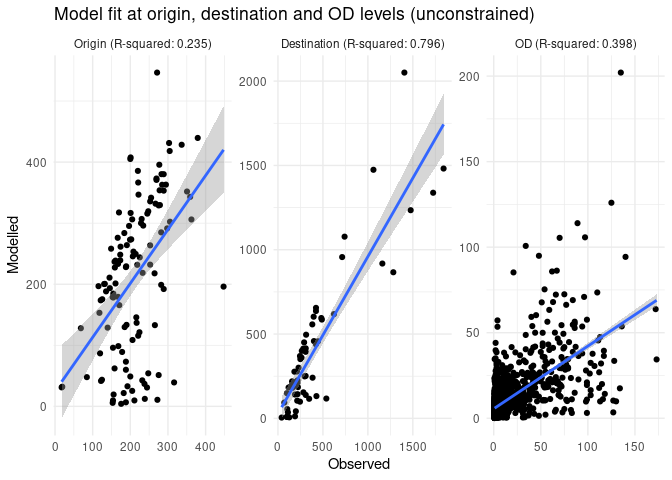
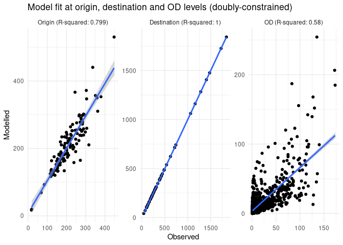
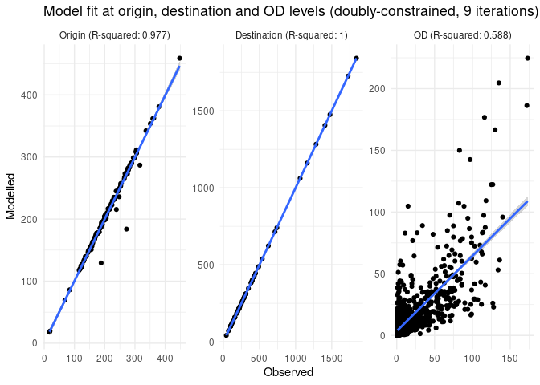

# Generate origin-destination data for route network generation


# Introduction

The code in this results demonstrates how to generate origin-destination
(OD) data for a given set of zones and destinations. OD data is a key
input into spatial interaction models (SIMs) for generating route
networks. (See [An introduction to spatial interaction models: from
first
principles](https://robinlovelace.github.io/simodels/articles/sims-first-principles.html)
introduction to SIMs for more information.) The code is fully
reproducible, although requires a validation dataset that is not in the
public domain to generate goodness-of-fit statistics shown in this
reproducible document.

Install the package as follows (you can also clone the repo and run
`devtools::load_all()`):

``` r
if (!require("devtools")) install.packages("devtools")
devtools::install_github("acteng/netgen")
```

The package uses the [`{simodels}` R
package](https://robinlovelace.github.io/simodels/) to pre-process the
input datasets and generate the OD data used as the basis of the
interaction prediction model. The input datasets are illustrated in the
figure below (these are `zones_york` and `destinations_york` that are
provided with the pacage):


Before we run any models let’s compare the total number of pupils in the
zones dataset and the destinations dataset (they should be the same):

``` r
zone_overestimate_factor = 
  (sum(zones_york$f0_to_15) + sum(zones_york$m0_to_15)) /
    sum(destinations_york$n_pupils)
zone_overestimate_factor
```

    [1] 1.194998

As one would expect, the total number of pupils in the zones dataset is
a bit bigger than the total number of pupils in the destinations
dataset: not all people aged 0 to 15 go to school, especially those
under school age. To tackle this issue we’ll create a new variables
called `pupils_estimated` in the zones dataset, which is the sum of the
number of pupils in the zones dataset and the number of pupils in the
destinations dataset.

``` r
zones_york = zones_york |>
  dplyr::mutate(
    pupils_estimated = (f0_to_15 + m0_to_15) / zone_overestimate_factor
  )
```

After the adjustment shown above, the totals in the origin and
destination columns should be the same:

``` r
sum(zones_york$pupils_estimated)
```

    [1] 25631

``` r
sum(destinations_york$n_pupils)
```

    [1] 25631

# Preprocessing

Based on these inputs the `si_to_od()` function generates the OD data,
as shown below (note: 2 versions are created, one with a maximum
distance constraint for speed of processing, important when working with
large datasets).

``` r
max_dist = 5000 # meters
od_from_si_full = simodels::si_to_od(zones_york, destinations_york)
od_from_si = simodels::si_to_od(zones_york, destinations_york, max_dist = max_dist)
```


The output OD dataset has column names taken from both the origin and
destination datasets, with the following column names:

     [1] "O"                                 "D"                                
     [3] "distance_euclidean"                "origin_LSOA21NM"                  
     [5] "origin_total"                      "origin_f0_to_15"                  
     [7] "origin_f16_to_29"                  "origin_f30_to_44"                 
     [9] "origin_f45_to_64"                  "origin_f65_and_over"              
    [11] "origin_m0_to_15"                   "origin_m16_to_29"                 
    [13] "origin_m30_to_44"                  "origin_m45_to_64"                 
    [15] "origin_m65_and_over"               "origin_pupils_estimated"          
    [17] "destination_n_pupils"              "destination_phase"                
    [19] "destination_type_of_establishment" "geometry"                         

# A basic model

## An unconstrained model

Let’s run a simple model:

``` r
gravity_model = function(beta, d, m, n) {
  m * n * exp(-beta * d / 1000)
} 
# perform SIM
od_res = simodels::si_calculate(
  od_from_si,
  fun = gravity_model,
  d = distance_euclidean,
  m = origin_pupils_estimated,
  n = destination_n_pupils,
#   constraint_production = origin_all,
  beta = 0.8
  )
```

We’ll make one adjustment to the output dataset, renaming the
`interaction` column to `trips`, and setting the total number of trips
to be the same as the total number of pupils in the destinations
dataset:

``` r
interaction_overestimate_factor = sum(destinations_york$n_pupils) / sum(od_res$interaction)
od_res = od_res |>
  dplyr::mutate(
    interaction = interaction * interaction_overestimate_factor
  )
```

We can assess the model fit at three levels: the origin level (number of
students departing from each zone), the destination level (the number
arriving at each school in the input dataset) and the origin-destination
level.



The R-squared value is 0.398.

## Optimising the value of beta

The beta parameter in the gravity model is a key parameter that
determines the strength of the distance decay effect.

We can optimise it with an objective function that minimises the
difference between the observed and modelled trips:

``` r
objective_function = function(beta) {
  od_res = simodels::si_calculate(
    od_from_si,
    fun = gravity_model,
    d = distance_euclidean,
    m = origin_pupils_estimated,
    n = destination_n_pupils,
    beta = beta
  )
  interaction_overestimate_factor = sum(destinations_york$n_pupils) / sum(od_res$interaction)
  od_res = od_res |>
    dplyr::mutate(
      trips = interaction * interaction_overestimate_factor
    )
  sum((od_res$trips - od_res$frequency)^2, na.rm = TRUE)
}
# Try it with beta of 0.8:
objective_function(0.8)
```

    [1] 586859.6

``` r
# Optimise it:
beta_opt = optimise(objective_function, c(0.1, 1))
beta_new = beta_opt$minimum
beta_new
```

    [1] 0.9064594

Let’s try re-running the model with the new beta value:

``` r
res_optimised = simodels::si_calculate(
  od_from_si,
  fun = gravity_model,
  d = distance_euclidean,
  m = origin_pupils_estimated,
  n = destination_n_pupils,
  beta = beta_new
  )
cor(res_optimised$frequency, res_optimised$interaction, use = "complete.obs")^2
```

    [1] 0.4012082

## Production-constrained model

Let’s see if making the model production constrained can help:

``` r
res_constrained = simodels::si_calculate(
  od_from_si,
  fun = gravity_model,
  d = distance_euclidean,
  m = origin_pupils_estimated,
  n = destination_n_pupils,
  constraint_production = origin_pupils_estimated,
  beta = beta_new
  )
```


The R-squared value is 0.571.

## Doubly-constrained model

Let’s implement a doubly-constrained model, starting with the outputs of
the production-constrained model:

``` r
res_doubly_constrained = res_constrained |>
  group_by(D) |>
  mutate(
    observed_group = first(destination_n_pupils),
    modelled_group = sum(interaction),
    modelled_overestimate_factor = modelled_group / observed_group,
    interaction = interaction / modelled_overestimate_factor
  )
# summary(res_doubly_constrained)
sum(res_doubly_constrained$interaction) == sum(res_constrained$interaction) 
```

    [1] TRUE



The R-squared value is 0.58.

The model is now ‘doubly constrained’ in a basic sense: the first
iteration constrains the totals for each origin to the observed totals,
and the second iteration constrains the totals for each destination to
the observed totals.

Let’s constrain by the origin totals again:

``` r
res_doubly_constrained_2 = res_doubly_constrained |>
  group_by(O) |>
  mutate(
    observed_group = first(origin_pupils_estimated),
    modelled_group = sum(interaction),
    modelled_overestimate_factor = modelled_group / observed_group,
    interaction = interaction / modelled_overestimate_factor
  )
```

And then by the destination totals again:

``` r
res_doubly_constrained_3 = res_doubly_constrained_2 |>
  group_by(D) |>
  mutate(
    observed_group = first(destination_n_pupils),
    modelled_group = sum(interaction),
    modelled_overestimate_factor = modelled_group / observed_group,
    interaction = interaction / modelled_overestimate_factor
  )
```

After one more full iteration of fitting to the observed totals, the
R-squared value is 0.594.

Additional iterations do not increase model fit against the observed OD
data in this case (working not shown).



# Model output

The model outputs OD data, with any of the columns listed below:

``` r
names(res_doubly_constrained_9)
```

     [1] "O"                                 "D"                                
     [3] "distance_euclidean"                "origin_LSOA21NM"                  
     [5] "origin_total"                      "origin_f0_to_15"                  
     [7] "origin_f16_to_29"                  "origin_f30_to_44"                 
     [9] "origin_f45_to_64"                  "origin_f65_and_over"              
    [11] "origin_m0_to_15"                   "origin_m16_to_29"                 
    [13] "origin_m30_to_44"                  "origin_m45_to_64"                 
    [15] "origin_m65_and_over"               "origin_pupils_estimated"          
    [17] "destination_n_pupils"              "destination_phase"                
    [19] "destination_type_of_establishment" "frequency"                        
    [21] "geometry"                          "interaction"                      
    [23] "trips"                             "observed_group"                   
    [25] "modelled_group"                    "modelled_overestimate_factor"     

For the purposes of this project, we’ll only use three of them:

``` r
res_output = res_doubly_constrained_9 |>
  select(O, D, trips_modelled = interaction)
summary(res_output)
```

          O                   D          trips_modelled               geometry   
     Length:4338        Min.   :121266   Min.   :  0.01305   LINESTRING   :4338  
     Class :character   1st Qu.:121711   1st Qu.:  0.72370   epsg:4326    :   0  
     Mode  :character   Median :142845   Median :  1.89543   +proj=long...:   0  
                        Mean   :137748   Mean   :  5.90848                       
                        3rd Qu.:144709   3rd Qu.:  5.61269                       
                        Max.   :150205   Max.   :224.64802                       

The results are saved as .csv and .geojson files ready for the next
step:

``` r
sf::write_sf(res_output, "res_output.geojson", delete_dsn = TRUE)
res_output |>
  sf::st_drop_geometry() |>
  write_csv("res_output.csv")
```

# Summary and next steps

The reproducible code in this vignette shows how to develop fast
reproducible spatial interaction models (SIMs) using the `{simodels}`
package. A simple model, using only one estimated parameter (beta) can
explain more than half of the variation in flows, as measured by the
R-squared value. This is not bad considering that York has a river so
many of the Euclidean distances are not representative of the actual
travel distances.

There are many ways the model could be refined:

- Using different models for different types of schools (e.g. primary
  and secondary schools).
- Using route distance rather than Euclidean distance to estimate flows
  and explore impact on model fit.
- Adding more parameters to the model, e.g. exponents on the origin and
  destination populations (see Wilson’s work for more on that).
- Using regression to estimate the impact of other variables on flows
- Using a more complex model, such as the radiation model.
- Scalability: it would be worth exploring how well the approach scales
  for all LSOAs and schools in the UK, for example, for example uses the
  `max_dist` parameter in the `od` package (work in progress to
  integrate this into the `simodels` package), see
  https://github.com/ITSLeeds/od/pull/48 for details.

For the purposes of this repo, however, we have demonstrated how to
rapidly generate plausible OD data that can feed into network generation
models.

<!-- Potentially useful out-takes/notes: -->
<!-- # Fitting model parameters
&#10;So far, arbitrary values have been used for the beta parameter in the gravity model.
Let's try to do better by fitting a model. -->
<!-- We'll first create a new distance variable that is 1 if the the distance is less than 1 km. -->
<!-- We'll also calculate the log of the distance. -->
<!-- We now fit models with `lm()`: -->
<!-- Basic linear models fail to predict the observed OD data, as shown by the R-squared values, which range from 0.218 to 0.333. -->
<!-- # Multi-level models
&#10;SIMs can be seen as a multi-level system, with origins and destinations at different levels.
We will try fitting a multi-level model to the data. -->
<!-- # Parameterising distance decay
&#10;Distance is a key determinant of travel.
Let's see what the relationship between distance and trips is in the observed data, a relationship that strengthens when we convert the number of trips between each OD pair to the proportion of trips made from each zone to each destination. -->
<!-- We can fit a model with exponential decay to the data, resulting in the following curves.
The model predicting the proportion of trips fits the data slightly better. -->
<!-- Let's see if we can get better fit with a multi-level model: -->
